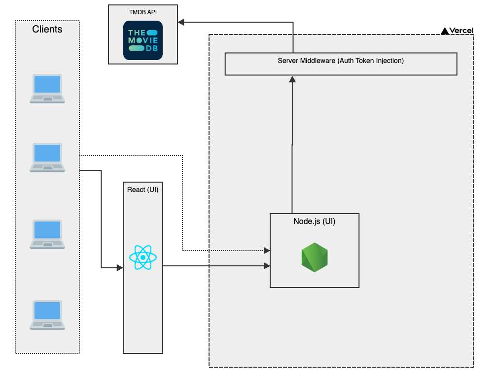

# 🎬 Pop Movies

Welcome to Pop Movies, a web app that showcases the latest in cinema. This project serves as a technical assessment, featuring a homepage for movie enthusiasts.

## 🚀 Live Demo

Check out the live demo [🍿 here](https://movies-app-eight-rho.vercel.app/) and explore the world of cinema!

## 🎥 Features

PopMovies allows you to:

- Browse the latest trending movies
- View detailed information about selected films

## 🛠 Tech Stack

Technologies used in this project include:

- **Next.js (App Router)**: To protect third-party API tokens in a server-side middle API handler.
- **React Query**: Manages data fetching and caching for an optimal user experience.
- **Vitest**: Handles fast, efficient, and simplier setup, for unit testing.

## ⚙️ Architecture Overview

I've chosen a client-server architecture to ensure a secure and efficient user experience. Here's a high-level overview of the architecture:

1. **Clients**: Users interact with the app from their devices.
2. **React (UI)**: Renders the UI and handles user interactions.
3. **Node.js (UI)**: Hosted on Vercel to serve the React UI and manage requests, while injects secure auth tokens for TMDB API requests securely in the server side as a middleware API handler.
4. **TMDB API**: Provides movie data such as trending movies, their details, and optimized movie images.

   

## 🎬 Getting Started

### Prerequisites

Ensure you have:

- Node.js with NPM (version 20 or higher)
- A TMDB account and API key (obtainable [here](https://developer.themoviedb.org/docs))

### Environment Variables

Create a `.env.local` file in the root of your project with the following environment variables:

```
TMDB_API_URL=https://api.themoviedb.org/3
TMDB_ACCESS_TOKEN=your_tmdb_access_token_here
```

### Installation Steps

1. Clone the repository:

   ```bash
   git clone https://github.com/djbautista/movies-app.git
   cd movies-app
   ```

2. Install dependencies:

   ```bash
   npm ci
   ```

3. Start the development server:

   ```bash
   npm run dev
   ```

4. Open [http://localhost:3000](http://localhost:3000) in your browser to begin exploring!

## 🎭 Testing

To run tests, use the following command:

```bash
npm test
```

Tests are managed using Vitest for quick and reliable results.
